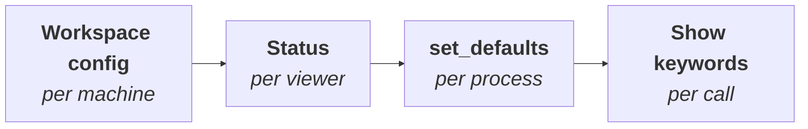

# Configuration layers

Three parties want a say in how the viewer looks, and the whole configuration story is about who wins when they disagree. (The practical reference is [the config system](../config.md); this page is the concept behind it.)

/// caption
Left to right: each stage overrides the one before it, and only for the keys it actually sets
///

## The three writers

1. **The viewer's settings store** — persistent, per machine: VS Code workspace settings, `~/.ocpvscode_standalone`, `~/.jcq_config`, Studio's settings dialog. This is "how I generally want my viewer to look", surviving restarts.
2. **Python defaults** (`set_defaults(...)`) — per Python process: "for this session, work like this". It overrides the settings store for every subsequent show in the process, and vanishes with the process.
3. **Show keywords** — per call: "this one, show like that". They override everything, once.

Higher number wins; each tier only fills in what the tier above didn't say.

## The fourth participant: the viewer's own state

What you change _in_ the running viewer — a toolbar toggle, a moved clipping slider, a hidden object in the tree — is neither a setting nor a keyword. It is the viewer's live **status**, continuously reported back to Python. On the next `show`, that status is merged in at the settings tier: the toggle you clicked persists, unless a `set_defaults` or a show keyword explicitly says otherwise.

That merge is what makes iterating comfortable — re-running a cell doesn't undo your toolbar — and it is also why `status()` and `combined_config()` exist: the first shows the viewer's live truth, the second shows what the _next_ show will actually use once all four voices are merged.

## Why the same keys appear three times

`axes`, `transparent`, `reset_camera` and their siblings appear in the settings store, in `set_defaults`, and as show keywords — deliberately. One vocabulary, three scopes: the _key_ means the same thing everywhere, only the _lifetime_ of the value differs. This is also what makes a setup portable across viewers: a value learnt in one viewer's settings means exactly the same in the next viewer's.
