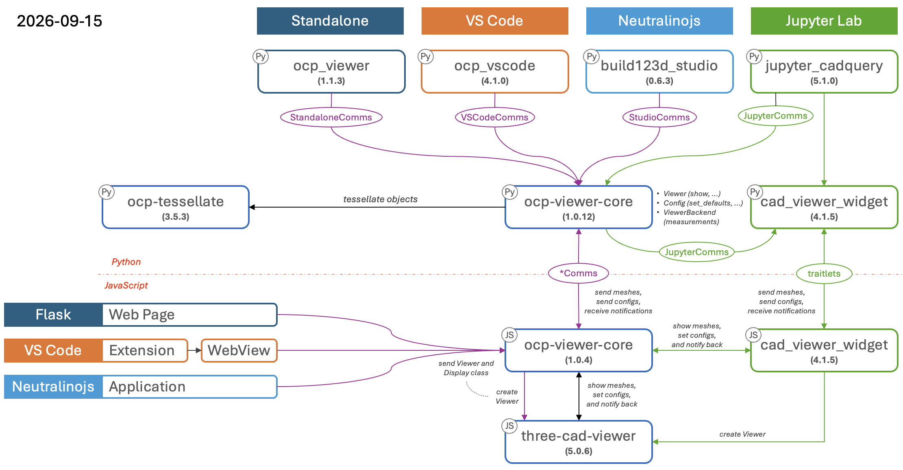

# The OCP CAD viewer documentation


Four viewers are built on [ocp-viewer-core](https://github.com/bernhard-42/ocp-viewer-core): [ocp_vscode](https://github.com/bernhard-42/vscode-ocp-cad-viewer) (the VS Code extension), [ocp_viewer](https://github.com/bernhard-42/ocp-viewer) (the standalone viewer), [Jupyter CadQuery](https://github.com/bernhard-42/jupyter-cadquery) (for Jupyter Lab) and [build123d Studio](https://github.com/bernhard-42/build123d-studio). They all share the same show commands, the same configuration semantics and the same viewer window, because all of that lives in the core. What differs per viewer is only how it is installed and started, where its settings are stored, and how Python reaches it.



/// caption
Dependencies of the viewer ecosystem
///

Most of these pages document the shared part, valid for every viewer. The per-viewer rest — installation, settings storage, ports and transports, debugging integrations — lives in the [Hosts](#hosts) chapter.

## One convention

Everything a user calls is imported from the host package — the package of the viewer in use. Every name shown on these pages — `show`, `set_defaults`, `Camera`, all of them — is exported identically by all four packages, so every example comes as one tab per viewer:

=== "ocp_viewer"

    ```python
    from ocp_viewer import show
    ```

=== "ocp_vscode"

    ```python
    from ocp_vscode import show
    ```

=== "jupyter_cadquery"

    ```python
    from jupyter_cadquery import show
    ```

=== "build123d_studio"

    ```python
    from build123d_studio import show
    ```

Pick your viewer's tab once — the choice applies to every example on every page and is remembered across visits. The import line is the only thing that names your viewer; the behavior after it is the same everywhere.

The one exception is a handful of keywords that address the viewer's surface rather than its content — `port` (ocp_vscode, ocp_viewer), `viewer` and its sidecar companions `anchor`, `cad_width`, `height`, `pinning` (jupyter_cadquery). Which viewer accepts which is spelled out in [show — Host keywords](show.md#host-keywords).

## The viewer

- [Overview](viewer.md) — what is on the screen and how to operate it: mouse navigation, the navigation tree, the toolbar, the tabs, keyboard shortcuts. This is the JavaScript half of the core, embedded by every host.
- Analysis tools:
  - [Measure mode](measure.md) — properties and distance/angle measurement in the viewer
  - [Object selection](selector.md) — pick faces, edges or vertices in the viewer and use their indices in code

## The Python API

Showing objects:

- [show](show.md) — show one or more CAD objects, and the full keyword reference shared by all show commands
- [show_object](show_object.md) — show objects incrementally, one call per object
- [push_object / show_objects](push_object.md) — collect objects without rendering, then render them in one batch
- [show_all](show_all.md) — show every CAD object in the current Python scope
- [Keeping the camera orientation](reset_camera.md) — the `reset_camera` semantics: keep, recenter, reset, or snap to a preset
- [Additional functions](api.md) — `show_clear`, `save_screenshot`, and blueprint images

Configuring:

- [The config system](config.md) — the three levels of configuration and their precedence, and the defaults and state inspection functions
- [set_viewer_config](set_viewer_config.md) — change a running viewer immediately, without a new show
- [Enums](enums.md) — `Camera`, `Collapse`, `Render`, `AnalysisTool`, `UiTab` and the Studio enums

Appearance:

- [Color maps](colormaps.md) — automatic color assignment for object collections
- [Materials and Studio mode](pbr_studio.md) — PBR materials and photo-realistic rendering
- [ImageFace](image_face.md) — place a 2-D image as a reference plane in the scene

## Animation

- [Animation](animation.md) — drive keyframe animations on shown assemblies

## Hosts

One chapter per viewer for what genuinely differs: installation, settings storage, port discovery and `set_port`, sidecars, visual debugging integrations, editor tooling, troubleshooting.

- VS Code CAD Viewer — [Installation](hosts/ocp_vscode/installation.md), [Workspace Config](hosts/ocp_vscode/workspace_config.md), [Addressing a viewer](hosts/ocp_vscode/addressing.md)
- OCP Viewer — [Installation](hosts/ocp_viewer/installation.md), [Workspace Config](hosts/ocp_viewer/workspace_config.md), [Addressing a viewer](hosts/ocp_viewer/addressing.md)
- Jupyter CadQuery — [Installation](hosts/jupyter_cadquery/installation.md), [Workspace Config](hosts/jupyter_cadquery/workspace_config.md), [Addressing a viewer](hosts/jupyter_cadquery/addressing.md)
- build123d Studio — [Installation](hosts/build123d_studio/installation.md), [Workspace Config](hosts/build123d_studio/workspace_config.md), [First Run](hosts/build123d_studio/first_run.md)
