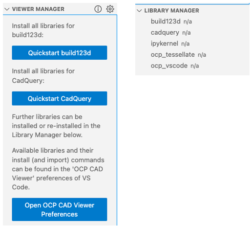
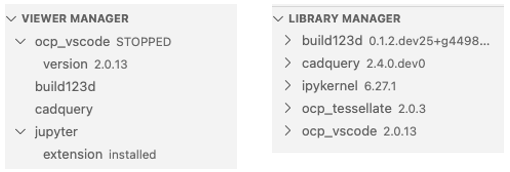
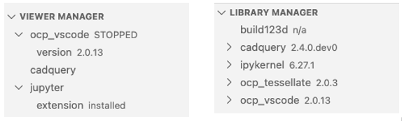

# Installation

The VS Code CAD Viewer is the extension **OCP CAD Viewer** plus the Python package **ocp_vscode**, installed at matching versions (major.minor — see [Versioning](../../concepts/versioning.md)).

## Prerequisites

- Microsoft VS Code 1.85.0 or newer, with the [Python extension](https://marketplace.visualstudio.com/items?itemName=ms-python.python) installed
- `python` and `pip` (or `uv pip` / `uv add`) available in the Python environment you will use for CAD development

The extension depends on VS Code using the right Python interpreter (your mamba / conda / pyenv / poetry / … environment): start VS Code from the command line in that environment, or select the interpreter in VS Code first.

## Installation within VS Code

1. Open the VS Code Marketplace, search for and install _OCP CAD Viewer_. Afterwards the viewer is available in the VS Code sidebar:

    

2. Clicking it shows the OCP CAD Viewer UI with the [Viewer Manager and Library Manager](managers.md):

    

    You have three options:

    - Prepare for [build123d](https://github.com/gumyr/build123d): press **Quickstart build123d**. This installs _OCP_, _build123d_, _ipykernel_ (_jupyter_client_), _ocp_tessellate_ and _ocp_vscode_ via `pip`:

        

    - Prepare for [CadQuery](https://github.com/cadquery/cadquery): press **Quickstart CadQuery**. This installs _OCP_, _CadQuery_, _ipykernel_ (_jupyter_client_), _ocp_tessellate_ and _ocp_vscode_ via `pip`:

        

    - Ignore the quickstarts and install the libraries one by one in the [Library Manager](managers.md#the-library-manager).

    Quickstart will also (optionally) install the [Jupyter extension for VS Code](https://marketplace.visualstudio.com/items?itemName=ms-toolsai.jupyter), start the viewer, and create a demo file in a temporary folder so there is immediately a working example on screen.

!!! warning

    Do not use the splash logo to verify your settings — it overwrites all settings with its own, to always look the same on every instance. Use a simple model of your own; if something is off, see [Troubleshooting](troubleshooting.md).

## Installation via CLI

If you prefer the command line, install the Python side directly — activate the virtual environment first:

- `uv`-based environments:

    ```bash
    source .venv/bin/activate
    uv add ocp-vscode
    ```

- other environments:

    ```bash
    source .venv/bin/activate                     # venv
    conda / mamba / micromamba activate <env>     # conda-like
    pip install ocp-vscode
    ```

Notes:

- `ocp-vscode` is published [on PyPI only](https://pypi.org/project/ocp-vscode/), so conda, mamba or micromamba environments need `pip` or `uv pip`.
- For Studio mode with MaterialX support, see [Materials and Studio](../../pbr_studio.md#material-setup).

## VSCodium and code-server

The extension is not on the [OpenVSX marketplace](https://open-vsx.org/), so VSCodium and [code-server](https://github.com/coder/code-server) need a manual install:

1. Go to the [releases page](https://github.com/bernhard-42/vscode-ocp-cad-viewer/releases) and download the latest `ocp-cad-viewer-<version>.vsix`.
2. VSCodium: install the `.vsix` via "Install from VSIX". code-server: run `code-server --install-extension ocp-cad-viewer-<version>.vsix` on the server.

## Version matching

Extension and Python package must agree on major.minor; the viewer UI and the Output panel report the check:

```text
extension.check_upgrade: ocp_vscode library version 2.9.0 is compatible with extension version 2.9.0
```

The command "Install `ocp_vscode` library" (also offered automatically) installs the Python side at the version the extension expects.

## Troubleshooting installs

- If the install message reports a missing `pip` or `uv pip`, confirm the selected Python interpreter actually has one of them available.
- For conda/mamba/micromamba environments, `pip` (or `uv pip`) must be used — the default commands handle this via the `{unset_conda}` placeholder (see [Library Manager](managers.md#customizing-the-install-commands)).
- If `python` cannot be found at all, restart VS Code after activating your virtual environment in the terminal, or pick the interpreter via the Python extension's "Select Interpreter" command.
