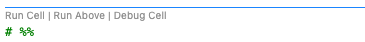

# Running code

Two ways to run a script against the viewer. Both work without breakpoints — for stepping through a model with the debugger, see [Visual debugging](visual_debugging.md).

## 1. Use Run without debugging

Run the file as usual with VS Code's **Run Without Debugging** (`Ctrl-F5`) or the **Run Python File** button. The script runs top to bottom in a fresh process, and every `show(...)` / `show_all()` call it reaches updates the viewer. This is the simplest loop: edit, run, look — the viewer keeps camera position and tree selection across runs, so re-running a script does not throw away your view.

## 2. Use Jupyter notebook mode

For an interactive workflow, use the [Jupyter extension](https://marketplace.visualstudio.com/items?itemName=ms-toolsai.jupyter) with `# %%` cell markers:

Make `# %%` the first line to initiate the Jupyter environment, then run cells with the "Run cell" button or `shift-enter` (run and move to next) / `ctrl-enter` (run and stay). Unlike option 1, state survives between cell runs — a common setup is one import cell at the top and `show(...)` / `show_all()` calls in the working cells. See [the config system](../../config.md) for the `set_defaults` pattern that usually goes with it.
