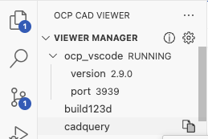

# Troubleshooting

## Generic ("it doesn't work")

1. Confirm that the VS Code extension and the Python module `ocp_vscode` have the same version. Both show in the OCP CAD Viewer UI, and the Output panel logs the check:

    ```text
    extension.check_upgrade: ocp_vscode library version 2.9.0 matches extension version 2.9.0
    ```

2. Test whether the standalone [OCP Viewer](../ocp_viewer/installation.md) works, to eliminate VS Code issues.
3. Open a work folder rather than a single Python file, to rule out Python path problems.
4. Check the Output panel (menu *View → Output*, select "OCP CAD Viewer Log" from the drop-down) for:
    - `PythonPath: '...'` — the correct Python executable and environment?
    - `OCPCADController.startCommandServer: Server listening on port ...` — the correct port? Default is 3939.
    - `OCPCADController.start: Starting websocket server ...` — should not be followed by an error.
    - `ocpCadViewer.ocpCadViewer: OCPCADController started with port ... and folders: ...` — the correct working folder?
5. If all looks fine so far, toggle *Developer Tools*[^1] in VS Code and look in the Console tab for errors related to `three-cad-viewer.esm.js`, `three.js` or WebGL.

[^1]: Use *shift-cmd-p* (Mac) or *shift-ctrl-p* (Windows/Linux) and select *Developer: Toggle Developer Tools*.

## Reliable Python detection

The extension depends on VS Code using the correct Python interpreter. The most reliable ways: start VS Code from the command line in the desired Python environment, or select the interpreter in VS Code first via the Python extension's "Select Interpreter".

## RuntimeError: Cannot access viewer config. Is the viewer running?

The additional warning at the top of the stacktrace says:

```text
UserWarning: The viewer doesn't seem to run: Port could not be cast to integer value as 'None'
```

- Is the viewer running? **⇒** Restart the viewer.
- Check `~/.ocpvscode`. With two viewers running, it should look like:

    ```json
    {
      "version": 2,
      "services": {
        "3939": "",
        "3940": ""
      }
    }
    ```

    **⇒** To reset it, replace its content with `{"version": 2, "services": {}}` — it is rebuilt when a viewer restarts. See [Addressing a viewer](addressing.md#troubleshooting) for how the registry is used.

## UserWarning: The viewer doesn't seem to run: [Errno 61] Connection refused

Are you using the right port? The **Viewer Manager** shows which port the viewer is running on:



(For the standalone [OCP Viewer](../ocp_viewer/installation.md), the port is in its startup output: `The viewer is running on http://127.0.0.1:3939/viewer`.)

**⇒** Given that port, `set_port(3939)` or `show(objects, port=3939)`. If the objects still don't show, restart the viewer: close the viewer tab (it cleans up behind itself) and start it again.

## CAD models are (almost always) invisible in the viewer window

```text
three-cad-viewer.esm.js THREE.WebGLProgram: Shader Error 0 - VALIDATE_STATUS false
Program Info Log: Program binary could not be loaded. Binary is not compatible with current driver/hardware combination.
```

VS Code's internal browser caches compiled WebGL artifacts like shaders. After a graphics driver update, the cached compiled version may not fit the new driver, producing this error. **Solution:** delete the VS Code browser cache — see e.g. [this guide](https://bobbyhadz.com/blog/vscode-clear-cache) for the per-OS locations.

## Configuration looks unexpected on the splash logo

Do not use the splash logo to verify your settings: the logo overwrites all settings with its own, to always look the same on every instance. **⇒** Use a simple model of your own to check your configuration.
